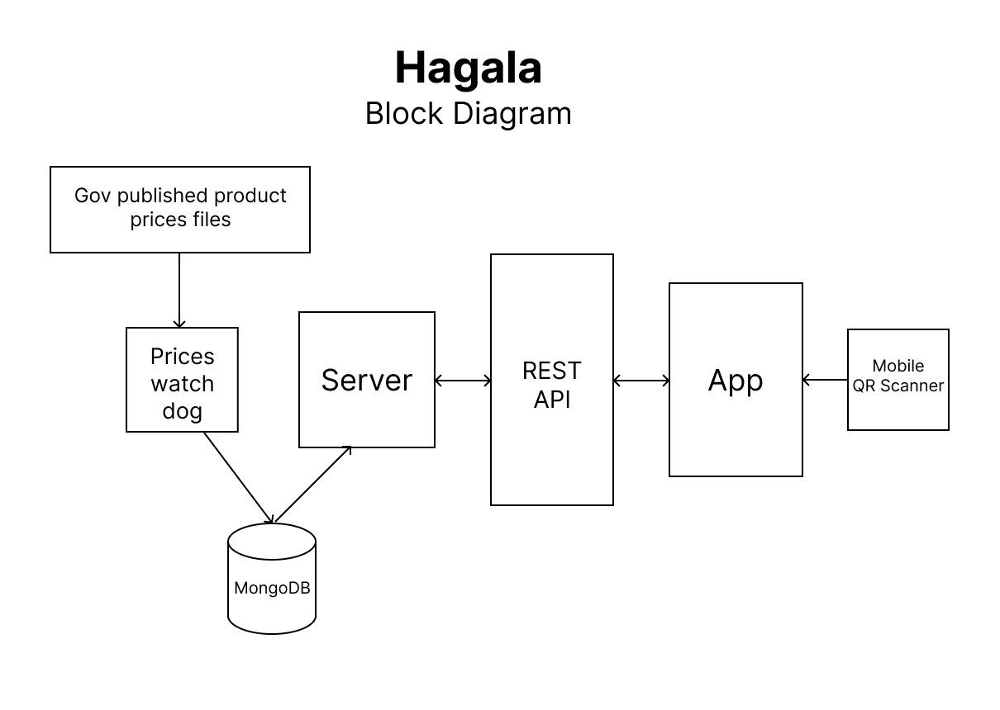
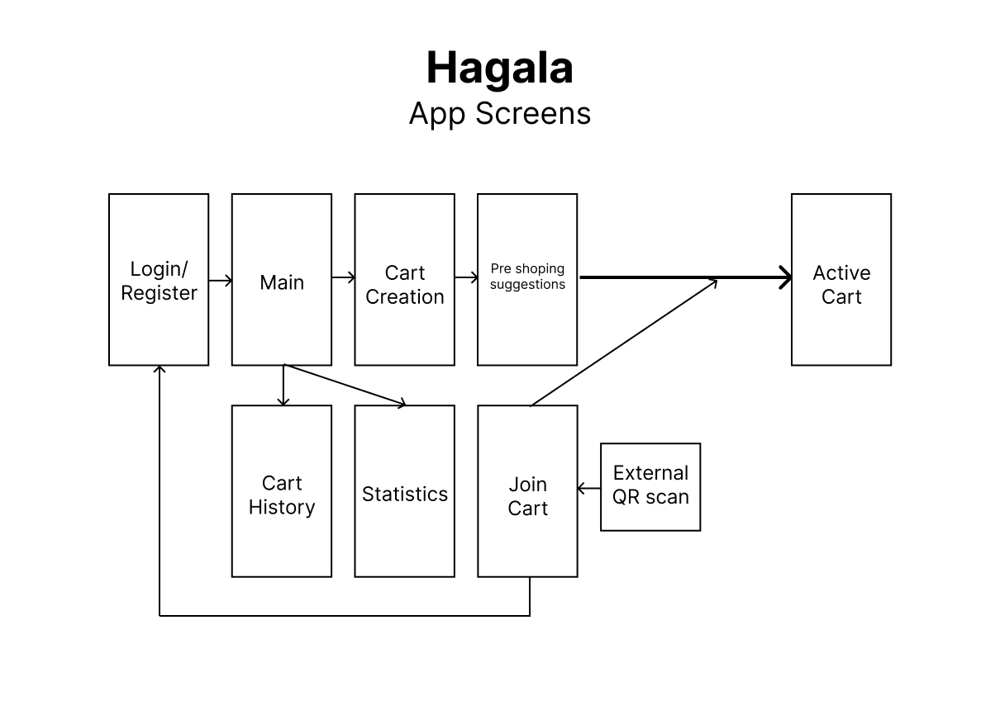

# Hagala

## Setup
1. Run `db-setup.mongodb.js` under `setup` folder to initialize mock data
2. Create `.env` file in root directory, and specify MongoDB connection string `MONGO_CONNECTION_STRING`
3. open terminal and run `npm run dev`

# Main Architecture

## Block Diagram

## Models Schema Diagram

## API library

## App Screens Diagram

